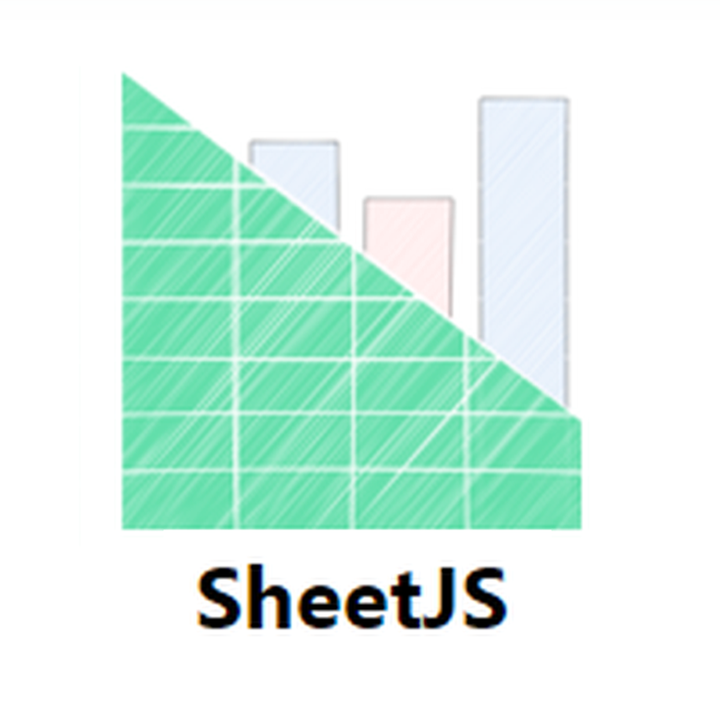

# Control de Inventario Web para Farmacia

**Deploy para uso real (en farmacia):** https://inventariofarmacia.netlify.app/
**Deploy de versión demostrativa (interactiva para usuarios):** https://inventariofarmaciav2.netlify.app/

  

Sistema de conciliación de inventario para retail desarrollado en JavaScript puro, orientado a pequeños y medianos comercios, con foco en farmacias y entornos que trabajan con inventarios basados en archivos Excel y pistolas de códigos de barras.

## 1. Descripción general del proyecto

Control de Inventario Web es una aplicación web que se ejecuta directamente en el navegador y permite conciliar inventario físico contra inventario teórico exportado desde un sistema POS (VOPOS). El sistema está diseñado para funcionar de manera offline, sin dependencias de backend ni frameworks, y prioriza la velocidad operativa, la claridad visual y la reducción de errores durante el conteo físico.

El proyecto está pensado tanto como herramienta real de uso operativo en tienda como demostración técnica para evaluación profesional, mostrando control total del DOM, manejo de datos estructurados y lógica de negocio aplicada a un problema real.

## 2. Problema que resuelve

En el proceso tradicional de inventario en farmacias y comercios similares, el personal debe recorrer la tienda con una lista impresa o digital y verificar manualmente, producto por producto, si las cantidades físicas coinciden con las registradas en el sistema. Este método es lento, propenso a errores humanos y poco eficiente cuando se manejan cientos o miles de referencias.

Además, este enfoque no permite visualizar de forma clara las diferencias, los productos faltantes, los sobrantes ni las inconsistencias generadas por duplicados o errores en la maestra de inventario. El resultado suele ser un proceso largo, con reprocesos y bajo nivel de confiabilidad.

## 3. Solución implementada

El proyecto propone una solución de conciliación automatizada basada en escaneo de códigos de barras y procesamiento directo de la maestra de inventario en Excel. A partir de un único archivo exportado desde VOPOS, el sistema permite realizar el conteo físico en tiempo real, recalcular diferencias automáticamente y presentar los resultados de forma visual e inmediata.

La solución elimina la necesidad de anotaciones manuales, cálculos mentales o verificaciones posteriores, permitiendo detectar inconsistencias en el mismo momento en que ocurren y reduciendo significativamente el tiempo total del inventario.

## 4. Tecnologías utilizadas

El sistema está desarrollado completamente en JavaScript puro (Vanilla JS), sin frameworks ni librerías de UI. Para la lectura y exportación de archivos Excel se utiliza SheetJS, incluida directamente en el repositorio, lo que permite el funcionamiento offline.

Se emplean APIs estándar del navegador para manipulación del DOM, manejo de eventos, almacenamiento local y descarga de archivos. El proyecto está diseñado para ejecutarse en cualquier navegador moderno sin configuración adicional.

  
  

## 5. Arquitectura del proyecto

La aplicación sigue una arquitectura modular, separando claramente las responsabilidades del sistema. La lógica de negocio, la manipulación de la interfaz, los servicios de carga y exportación de datos y los componentes de interacción están organizados en módulos independientes.

Esta estructura facilita el mantenimiento, la lectura del código y la incorporación de nuevas funcionalidades, además de demostrar un enfoque profesional en la organización del frontend sin depender de frameworks.

## 6. Flujo de funcionamiento

El flujo general comienza con la carga de la maestra de inventario en formato Excel. En la versión pública del proyecto, el archivo se carga automáticamente desde el repositorio para facilitar la experiencia de demostración. En un entorno real de tienda, el archivo sería cargado mediante un input de tipo archivo.

Una vez cargado, el sistema procesa los datos y los renderiza en una tabla HTML enriquecida, agregando columnas adicionales necesarias para la conciliación, como conteo real y diferencia. A partir de este punto, el usuario puede iniciar el conteo físico mediante escaneo de productos con la pistola de códigos de barras.

  

## 7. Gestión de inventario y lógica de negocio

El núcleo del sistema es el conteo por escaneo de códigos de barras. La pistola funciona como un teclado, ingresando el código directamente en un campo dedicado. Cuando el código coincide con un producto de la tabla, el sistema localiza la fila correspondiente y actualiza el conteo.

El incremento del conteo no es fijo. El sistema analiza la unidad de medida y la descripción del producto para determinar cuántas unidades reales deben sumarse. Por ejemplo, un producto descrito como "CAJ X 30" incrementa el conteo en 30 unidades si la unidad base es tableta, mientras que productos contados por caja incrementan en una sola unidad. Esta lógica permite reflejar con precisión la realidad física del inventario.

Cada actualización recalcula automáticamente la diferencia entre el saldo de la maestra y el conteo real, resaltando visualmente los resultados para una interpretación inmediata.

Ejemplo de CAJA X 50 con unidad de medida TABLETA:

  

Ejemplo de CAJA X 100 con unidad de medida CAJA:

  

## 8. Filtros y herramientas de análisis

El sistema incorpora filtros específicos pensados para el análisis de inventario y la limpieza de datos una vez finalizado el conteo. Cada filtro está diseñado para resolver un problema concreto del proceso operativo y puede utilizarse de forma independiente o combinada.

### Filtro de diferencias en cero

Este filtro oculta todos los productos cuya diferencia entre el saldo de la maestra y el conteo real es igual a cero. Su objetivo es reducir el ruido visual y permitir que el usuario se concentre únicamente en los productos con inconsistencias reales.

  

### Filtro alfabético por descripción

Permite visualizar únicamente los productos cuya descripción comienza con una letra específica. Este filtro resulta útil para búsquedas puntuales o verificaciones dirigidas dentro de inventarios extensos.

  

### Filtro de eliminación de productos duplicados

En algunas maestras generadas por el sistema POS es común encontrar productos duplicados que comparten el mismo código interno pero poseen distintos códigos de barras. Este filtro identifica estos casos y conserva el registro que presenta conteo, eliminando aquel que no fue escaneado, evitando duplicados en los resultados finales.

  

### Quitar filtros

Restaura la visualización original de la tabla, eliminando cualquier filtro activo y devolviendo el inventario a su estado completo.

  

## 9. Persistencia, respaldo y exportación

El sistema permite exportar los resultados a un nuevo archivo Excel en cualquier momento. El archivo generado refleja exactamente lo que el usuario está visualizando en pantalla, respetando los filtros activos y el estado actual del inventario.

El formato del archivo exportado mantiene compatibilidad con la maestra original, lo que permite reutilizarlo como punto de guardado. Si este archivo se vuelve a cargar en la aplicación, el sistema puede continuar el proceso sin pérdida de información, funcionando como un respaldo del estado del inventario.

Como parte del repositorio se incluye un archivo Excel de ejemplo con aproximadamente 1600 productos, pensado para fines de demostración y practicidad para el usuario. No obstante, el sistema ha sido probado en entornos reales con inventarios de 4000 a 5000 productos, manteniendo un rendimiento estable y tiempos de respuesta adecuados durante el conteo y la aplicación de filtros.

  

Ejemplo del excel descargado:

  

## 10. Escalabilidad y proyección

Aunque el proyecto funciona actualmente como una aplicación local y offline, su diseño permite una evolución natural hacia una arquitectura más robusta. Es posible incorporar autenticación de usuarios, almacenamiento en la nube y un backend en Node.js para persistencia de datos y gestión multiusuario.

A futuro, el sistema podría integrarse directamente con POS como VOPOS, sincronizar ventas y ajustes de stock en tiempo real y ofrecer funcionalidades avanzadas como reportes históricos, análisis de rotación, alertas de quiebre de stock y soporte para múltiples sucursales. Esto posiciona el proyecto como una base sólida para una solución comercial escalable y reutilizable.

## 11. Autor

**Emanuel Orjuela Barbosa**

Correo: emanuelorjuelabarbosa12@gmail.com

Instagram: https://www.instagram.com/emx.dev

Github: https://github.com/Emanuelorjuela

Este proyecto demuestra cómo una solución web ligera, desarrollada en JavaScript puro, puede resolver de forma efectiva un problema operativo real en entornos de retail. La aplicación optimiza el proceso de inventario físico, reduce errores humanos y mejora la lectura de resultados en tiempo real, manteniendo un rendimiento estable incluso con inventarios de gran tamaño.

