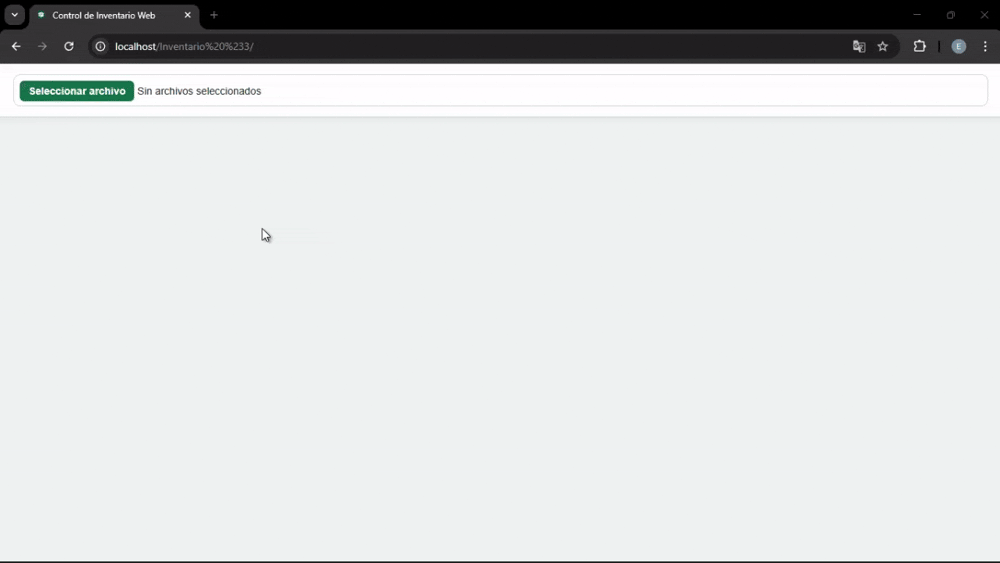
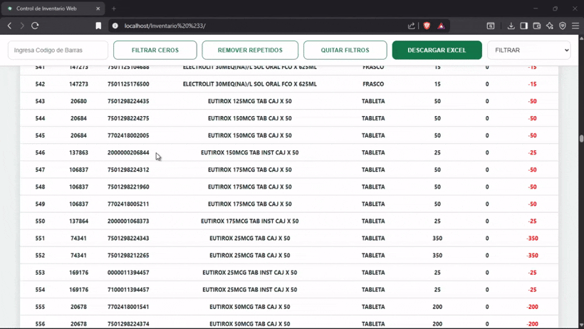
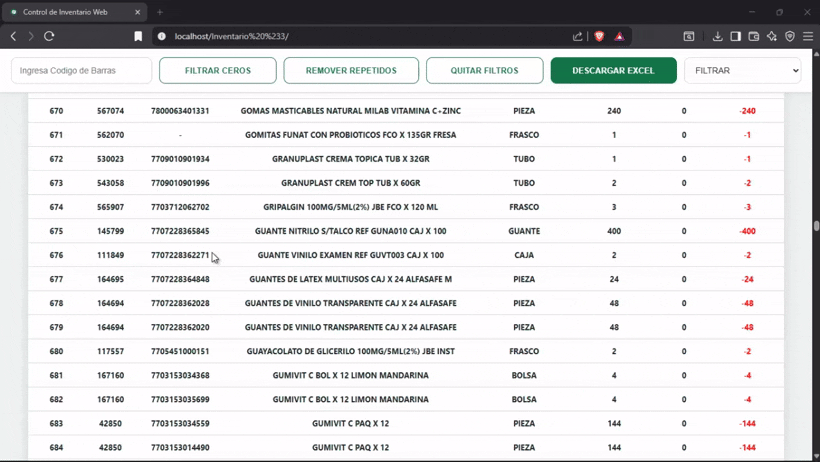
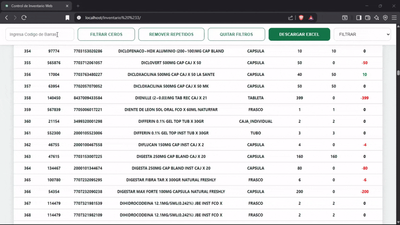
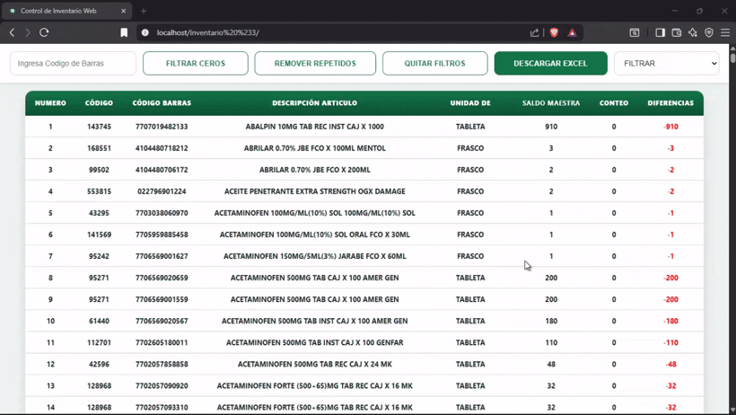
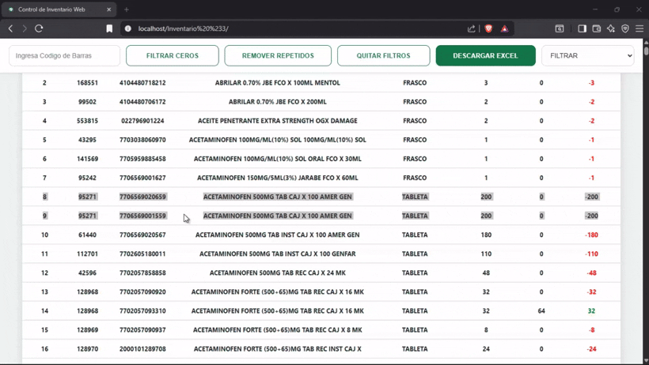
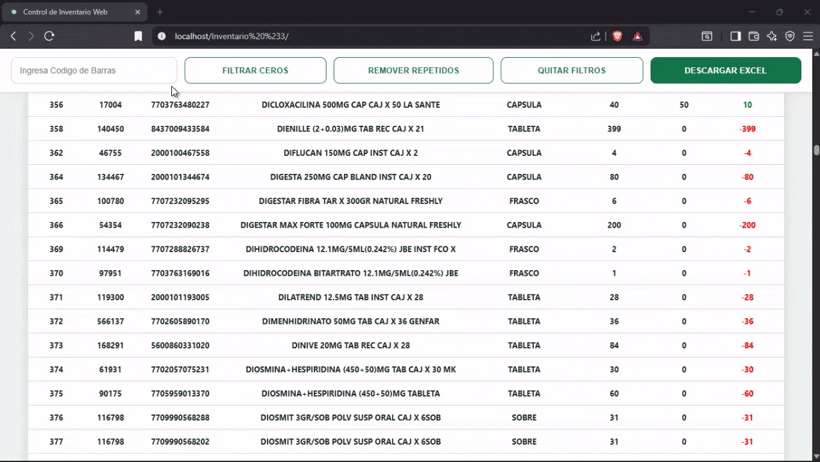
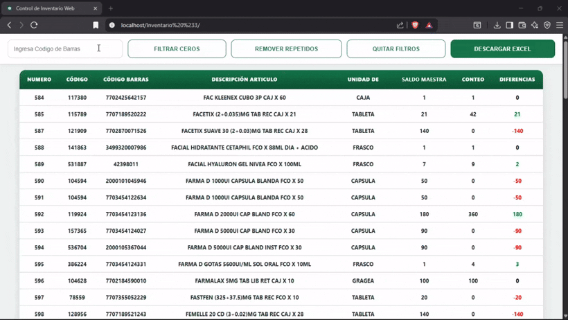
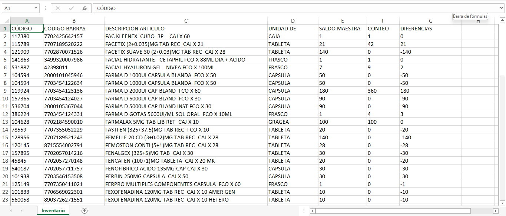

# Web Inventory Control for Pharmacy

**Deploy for real use (in pharmacy):** https://inventariofarmacia.netlify.app/

**Demo version deploy (interactive for users):** https://inventariofarmaciav2.netlify.app/

  

Retail inventory reconciliation system developed in pure JavaScript, oriented toward small and medium-sized businesses, with a focus on pharmacies and environments that work with Excel-based inventories and barcode scanners.

## 1. General project description

Web Inventory Control is a web application that runs directly in the browser and allows physical inventory to be reconciled against theoretical inventory exported from a POS system (VOPOS). The system is designed to work without backend dependencies or frameworks, prioritizing operational speed, visual clarity, and error reduction during physical counting.

The project is designed both as a real operational tool for in-store use and as a technical demonstration for professional evaluation, showcasing full DOM control, structured data handling, and business logic applied to a real-world problem.

## 2. Problem it solves

In the traditional inventory process in pharmacies and similar businesses, staff must walk through the store with a printed or digital list and manually verify, product by product, whether the physical quantities match those recorded in the system. This method is slow, prone to human error, and inefficient when dealing with hundreds or thousands of product references.

Additionally, this approach does not allow clear visualization of discrepancies, missing products, excess stock, or inconsistencies caused by duplicates or errors in the inventory master file. The result is usually a long process with rework and low reliability.

## 3. Implemented solution

The project proposes an automated reconciliation solution based on barcode scanning and direct processing of the inventory master Excel file. Using a single file exported from VOPOS, the system allows physical counting in real time, automatically recalculates differences, and presents the results visually and immediately.

The solution eliminates the need for manual notes, mental calculations, or later verification, allowing inconsistencies to be detected at the moment they occur and significantly reducing the total time required for inventory.

## 4. Technologies used

The system is developed entirely in pure JavaScript (Vanilla JS), without frameworks or UI libraries. SheetJS is used for reading and exporting Excel files and is included directly in the repository.

Standard browser APIs are used for DOM manipulation, event handling, local storage, and file downloads. The project is designed to run in any modern browser without additional configuration.

  
  

## 5. Project architecture

The application follows a modular architecture, clearly separating system responsibilities. Business logic, interface manipulation, data loading and exporting services, and interaction components are organized into independent modules.

This structure facilitates maintenance, code readability, and the addition of new features, while also demonstrating a professional approach to frontend organization without relying on frameworks.

## 6. Workflow

The general flow begins with loading the inventory master file in Excel format. In the public version of the project, the file loads automatically from the repository to simplify the demonstration experience. In a real store environment, the file would be loaded through a file input.

Once loaded, the system processes the data and renders it into an enriched HTML table, adding additional columns necessary for reconciliation such as real count and difference. From this point, the user can begin the physical counting process by scanning products using the barcode scanner.

  

## 7. Inventory management and business logic

The core of the system is counting through barcode scanning. The scanner works as a keyboard, entering the code directly into a dedicated field. When the code matches a product in the table, the system locates the corresponding row and updates the count.

The count increment is not fixed. The system analyzes the unit of measurement and the product description to determine how many real units should be added. For example, a product described as "BOX X 30" increases the count by 30 units if the base unit is tablet, while products counted by box increase by a single unit. This logic allows the physical reality of the inventory to be represented accurately.

Each update automatically recalculates the difference between the master balance and the real count, visually highlighting the results for immediate interpretation.

Example of CAJA X 50 with unit of measure TABLETA:

  

Example of CAJA X 100 with unit of measure CAJA:

  

## 8. Filters and analysis tools

The system includes specific filters designed for inventory analysis and data cleanup after counting is completed. Each filter is designed to solve a specific operational problem and can be used independently or combined.

### Zero difference filter

This filter hides all products whose difference between the master balance and the real count is equal to zero. Its objective is to reduce visual noise and allow the user to focus only on products with real inconsistencies.

  

### Alphabetical filter by description

Allows the user to view only products whose description begins with a specific letter. This filter is useful for targeted searches or directed verification within large inventories.

  

### Duplicate product removal filter

In some master files generated by POS systems, it is common to find duplicate products that share the same internal code but have different barcodes. This filter identifies these cases and keeps the record that contains a count, removing the one that was not scanned, preventing duplicates in the final results.

  

### Remove filters

Restores the original table view by removing any active filters and returning the inventory to its full state.

  

## 9. Persistence, backup, and export

The system allows results to be exported to a new Excel file at any time. The generated file reflects exactly what the user is seeing on screen, respecting active filters and the current state of the inventory.

The exported file format maintains compatibility with the original master file, allowing it to be reused as a save point. If this file is loaded again into the application, the system can continue the process without losing information, functioning as a backup of the inventory state.

As part of the repository, an example Excel file with approximately 1600 products is included, intended for demonstration purposes and user convenience. However, the system has been tested in real environments with inventories of 4000 to 5000 products, maintaining stable performance and adequate response times during counting and filter application.

  

Example of the downloaded Excel file:

  

## 10. Scalability and projection

Although the project currently functions as a local application, its design allows for natural evolution toward a more robust architecture. It is possible to incorporate user authentication, cloud storage, and a Node.js backend for data persistence and multi-user management.

In the future, the system could integrate directly with POS systems such as VOPOS, synchronize sales and stock adjustments in real time, and offer advanced features such as historical reports, stock shortage alerts, and support for multiple branches. This positions the project as a solid foundation for a scalable and reusable commercial solution.

## 11. Author

**Emanuel Orjuela Barbosa**

Email: emanuelorjuelabarbosa12@gmail.com

Instagram: https://www.instagram.com/emx.dev

Github: https://github.com/Emanuelorjuela

This project demonstrates how a lightweight web solution developed in pure JavaScript can effectively solve a real operational problem in retail environments. The application optimizes the physical inventory process, reduces human errors, and improves real-time interpretation of results while maintaining stable performance even with large inventories.

